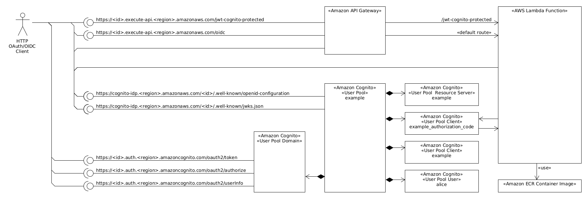

# About

[](https://github.com/rgl/terraform-aws-cognito-example/actions/workflows/lint.yml)

This deploys an example [Amazon Cognito IdP](https://aws.amazon.com/cognito/), [Amazon API Gateway](https://aws.amazon.com/api-gateway/), and [AWS Lambda Function](https://aws.amazon.com/lambda/).

The following components are used:



This will:

* Use the [Amazon Cognito IdP Service](https://aws.amazon.com/cognito/).
  * Create a Cognito User Pool.
  * Create a Cognito User Pool Resource Server.
  * Create a Cognito User Pool Domain.
  * Create a Cognito User Pool User.
  * Create a Cognito User Pool Client for the [OAuth 2.0 Client Credentials Grant Type](https://oauth.net/2/grant-types/client-credentials/).
  * Create a Cognito User Pool Client for the [OAuth 2.0 Authorization Code Grant Type](https://oauth.net/2/grant-types/authorization-code/).
* Build an example Go AWS Lambda Function as a Container Image.
  * Implement a OAuth 2.0 Resource Server.
    * Validate the token created by a OAuth 2.0 Client Credentials Grant Type Client.
    * Validate the token created by a OAuth 2.0 Authorization Code Grant Type Client.
      * With [Proof Key for Code Exchange (PKCE)](https://oauth.net/2/pkce/).
  * Upload it to the [Amazon ECR](https://aws.amazon.com/ecr/).
* Create an [Amazon API Gateway](https://aws.amazon.com/api-gateway/).
  * Configure it to use the Go AWS Lambda Function.
  * Configure a route to require JWT authorization.

# Usage (on a Ubuntu Desktop)

Install the dependencies:

* [AWS CLI](https://docs.aws.amazon.com/cli/latest/userguide/getting-started-install.html).
* [Terraform](https://www.terraform.io/downloads.html).
* [Docker](https://docs.docker.com/engine/install/).

Set the AWS Account credentials using SSO:

```bash
# set the environment variables to use a specific profile.
# e.g. use the pattern <aws-sso-session-name>-<aws-account-name>-<aws-account-role>-<aws-account-id>
export AWS_PROFILE=example-dev-AdministratorAccess-123456
unset AWS_ACCESS_KEY_ID
unset AWS_SECRET_ACCESS_KEY
unset AWS_DEFAULT_REGION
# set the account credentials.
# see https://docs.aws.amazon.com/cli/latest/userguide/sso-configure-profile-token.html#sso-configure-profile-token-auto-sso
aws configure sso
# dump the configured profile and sso-session.
cat ~/.aws/config
# show the user, user amazon resource name (arn), and the account id, of the
# profile set in the AWS_PROFILE environment variable.
aws sts get-caller-identity
```

Or, set the AWS Account credentials using an Access Key:

```bash
# set the account credentials.
# NB get these from your aws account iam console.
#    see Managing access keys (console) at
#        https://docs.aws.amazon.com/IAM/latest/UserGuide/id_credentials_access-keys.html#Using_CreateAccessKey
export AWS_ACCESS_KEY_ID='TODO'
export AWS_SECRET_ACCESS_KEY='TODO'
unset AWS_PROFILE
# set the default region.
export AWS_DEFAULT_REGION='eu-west-1'
# show the user, user amazon resource name (arn), and the account id.
aws sts get-caller-identity
```

Review the [`inputs.tf`](inputs.tf) file.

Initialize the project:

```bash
terraform init -lockfile=readonly
```

Deploy the example:

```bash
terraform apply
```

Show the terraform state:

```bash
terraform state list
terraform show
```

Get an authorization token using the OAuth 2.0 Client Credentials Grant:

```bash
token_url="$(terraform output --raw oidc_token_url)"
jwks_url="$(terraform output --raw oidc_jwks_url)"
userinfo_url="$(terraform output --raw oidc_userinfo_url)"
client_id="$(terraform output --raw example_client_id)"
client_secret="$(terraform output --raw example_client_secret)"
# see https://docs.aws.amazon.com/cognito/latest/developerguide/token-endpoint.html
token_response="$(curl \
  -s \
  -X POST \
  -u "$client_id:$client_secret" \
  -d "grant_type=client_credentials&client_id=$client_id&client_secret=$client_secret" \
  "$token_url")"
jq <<<"$token_response"
# NB In Cognito, this token is a JWT (as defined in the JSON Web Token (JWT)
#    Profile for OAuth 2.0 Access Tokens at
#    https://datatracker.ietf.org/doc/html/rfc9068).
# NB Cognito does not let us validate the a client credentials access token by
#    calling the userinfo url (it requires the oidc scope; but client
#    credentials clients cannot use that scope in Cognito). This means we must
#    validate it using the keys available at the JWKS URL.
token="$(jq -r .access_token <<<"$token_response")"
# NB this will not work. its here just do show that it will not work.
# NB the example service will validate the token using the JWKS, and will
#    populate the response with the authorizationClaims property. see the
#    source code in example/main.go.
curl \
  -s \
  -X GET \
  -H "Authorization: Bearer $token" \
  "$userinfo_url" \
  | jq
```

Access the example service (hosted by the Go AWS Lambda Function Container),
using the token:

```bash
example_url="$(terraform output --raw example_url)"
curl \
  -s \
  -X GET \
  -H "Authorization: Bearer $token" \
  "$example_url" \
  | jq
```

The authorization bearer token will be validated by the example service, and its claims will be returned in the `authorizationClaims` response property. It will returns something alike:

```json
{
  "authorizationClaims": {
    "auth_time": 1,
    "client_id": "6xxxxxxxxxxxxxxxxxxxxxxxx7",
    "exp": "2024-04-10T07:12:09Z",
    "iat": "2024-04-10T08:12:09Z",
    "iss": "https://cognito-idp.eu-west-1.amazonaws.com/eu-west-1_xxxxxxxxxx",
    "jti": "76543210-aaaa-bbbb-cccc-dddddddddddd",
    "scope": "example/auth",
    "sub": "6xxxxxxxxxxxxxxxxxxxxxxxx7",
    "token_use": "access",
    "version": 2
  }
}
```

Access the example service endpoint protected by the API Gateway, without, and with a token:

```bash
example_url="$(terraform output --raw example_url)"
# without token.
# NB this should fail with an Unauthorized error.
curl \
  -s \
  -X GET \
  "$example_url/jwt-cognito-protected" \
  | jq
# with token.
# NB this should succeed and you should see the claims, validated by the
#    api gateway in the apiGatewayAuthorizationClaims response property.
curl \
  -s \
  -X GET \
  -H "Authorization: Bearer $token" \
  "$example_url/jwt-cognito-protected" \
  | jq
```

Start the OIDC Authorization Code Grant flow dance, and login as `alice:HeyH0Password!`:

```bash
example_authorization_code_oidc_redirect_url="$(terraform output --raw example_authorization_code_oidc_redirect_url)"
xdg-open "$example_authorization_code_oidc_redirect_url"
```

At the end of the dance, you should see the user claims, something like:

```json
{
  "iss": "https://cognito-idp.eu-west-1.amazonaws.com/eu-west-1_xxxxxxxxxx",
  "sub": "c5e4ae65-7d41-4652-b9e0-6858b6446186",
  "preferred_username": "alice",
  "email": "alice@example.com",
  "email_verified": true,
  "name": "Alice Doe",
  "given_name": "Alice",
  "family_name": "Doe"
}
```

Destroy the example:

```bash
terraform destroy
```

List this repository dependencies (and which have newer versions):

```bash
GITHUB_COM_TOKEN='YOUR_GITHUB_PERSONAL_TOKEN' ./renovate.sh
```

# Notes

* There is no way to rotate a `aws_cognito_user_pool_client` (aka app) client
  secret. Instead, the client must be re-created.
  * See the [App client types, Client secret documentation](https://docs.aws.amazon.com/cognito/latest/developerguide/user-pool-settings-client-apps.html#user-pool-settings-client-app-client-types).

# References

* [Amazon Cognito Documentation](https://docs.aws.amazon.com/cognito/index.html).
  * [OAuth 2.0, OpenID Connect, and SAML 2.0 federation endpoints reference](https://docs.aws.amazon.com/cognito/latest/developerguide/federation-endpoints.html).
  * [Using PKCE in authorization code grants with Amazon Cognito user pools](https://docs.aws.amazon.com/cognito/latest/developerguide/using-pkce-in-authorization-code.html).
  * [Amazon Cognito User Pools API Reference Documentation](https://docs.aws.amazon.com/cognito-user-identity-pools/latest/APIReference/Welcome.html).
* [OAuth 2.0 Grant Types](https://oauth.net/2/grant-types/).
  * [OAuth 2.0 Client Credentials Grant Type](https://oauth.net/2/grant-types/client-credentials/).
  * [OAuth 2.0 Authorization Code Grant Type](https://oauth.net/2/grant-types/authorization-code/).
